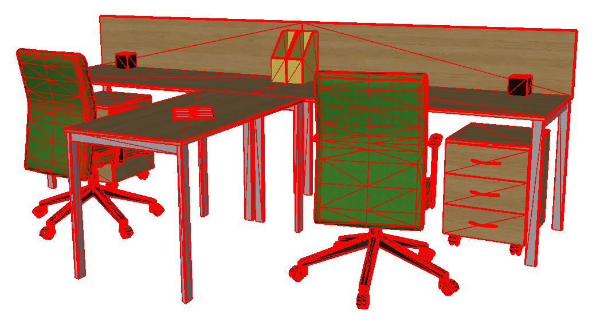
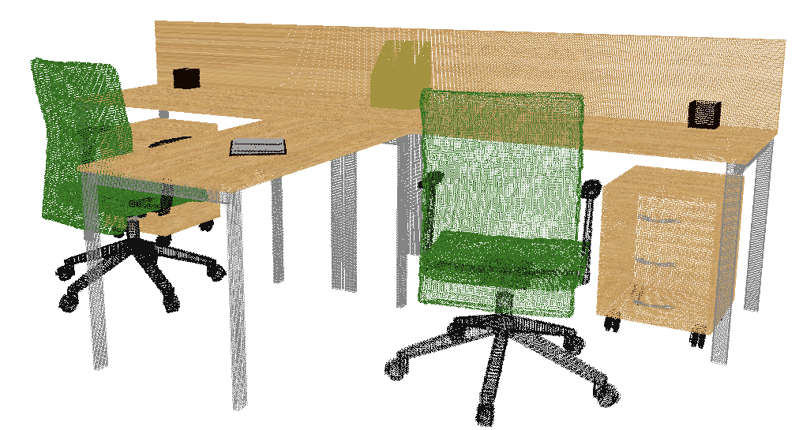

# scn2pointcloud_tool Documentation

The aim of this tool is to achieve data conversion from the format of CAD models, such as .obj/.off file, to the format  of **point cloud with RGB and labels**. The convert result of this tool is as follows.

The display of an OBJ file:



The display of its corresponding output:



The tool is designed for the use of SUNCG dataset and based on the data organization of SUNCG dataset, so, for other dataset of CAD models, the tool may be not compatible completely. For more details about SUNCG dataset, please see [here](http://suncg.cs.princeton.edu/).

The tool is adapted from [SUNCGtoolbox](https://github.com/shurans/SUNCGtoolbox), which is adapted from GAPS. The original GAPS README is on the bottom.

### Bibtex

 If you find this tool useful in your research, please consider citing our [paper](http://arxiv.org/abs/1707.06783) .

```
@article{liu20173ad, 
    title= {3DCNN-DQN-RNN: A Deep Reinforcement Learning Framework for Semantic Parsing of Large-scale 3D  Point Clouds}, 
    author= {Liu, Fangyu and Li, Shuaipeng and Zhang, Liqiang and Zhou, Chenghu and Ye, Rongtian and Wang, Yuebin and Lu, Jiwen}, 
    journal={IEEE International Conference on Computer Vision (ICCV)}, 
    year={2017} 
}
```

### Tool Organization

```
data_func
    |-- demo.py - display how to implement the conversion
    |-- data_module.py - build a link between libdata.so and python function
    |-- libdata.so - Dynamic Link Library produced by g++
SUNCGtoolbox
    |--gaps
      |-- pkgs - source and include files for all packages (software libraries)
      |-- apps
          |--scn2pointcloud - program that implements the conversion algorithm
      |-- makefiles - unix-style make file definitions
      |-- vc - visual studio solution files
      |-- lib - archive library (.lib) files (created during compilation)
      |-- bin - executable files (created during compilation)
    |--metadata
```

**Note**: SUNCGtoolbox's organization is almost same as [SUNCGtoolbox](https://github.com/shurans/SUNCGtoolbox). A number of  class files are modified to achieve the aim of conversion algorithm.

### How to Use

##### Compilation

```cmake
cd SUNCGtoolbox/gaps
make clean
make
```

##### Generate Dynamic Link Library

```cmake
cd SUNCGtoolbox/gaps/apps/scn2pointcloud/
g++ -shared -fPIC -o libdata.so scn2pointcloud.cpp  -L../../lib/x86_64 -g -lR3Graphics -lR3Shapes -lR2Shapes -lRNBasics -ljpeg -lpng   -lfglut -lGLU -lGL -lX11 -lm -I. -I../../pkgs  -g
```

If nothing is wrong, you will get a file named libdata.so, the method to use this file is displayed in data_func.

### GAPS README

GAPS Users -

This directory contains all code for the GAPS software library.
There are several subdirectories:

    pkgs - source and include files for all packages (software libraries).
    apps - source files for several application and example programs. 
    makefiles - unix-style make file definitions
    vc - visual studio solution files
    lib - archive library (.lib) files (created during compilation).
    bin - executable files (created during compilation).

If you are using linux or cygwin and have gcc and OpenGL development
libraries installed, or if you are using MAC OS X with the xcode
development environment, you should be able to compile all the code by
typing "make clean; make" in this directory.  If you are using Windows
Visual Studio 10 or later, then you should be able to open the
solution file vc.sln in the vc subdirectory and then "Rebuild
Solution."  For other development platforms, you should edit the shared
compilation settings in the makefiles/Makefiles.std to meet your needs.

To write a program that uses the GAPS pkgs, then you should include
"-I XXX/gaps/pkgs" in your compile flags (CFLAGS) and "-L
XXX/gaps/lib" in your link flags (LDFLAGS), where XXX is the directory
where you installed the gaps software.

The software is distributed under the MIT license (see LICENSE.txt)
and thus can be used for any purpose without warranty, any liability,
or any suport of any kind.

- [Tom Funkhouser](http://www.cs.princeton.edu/%7Efunk/)

